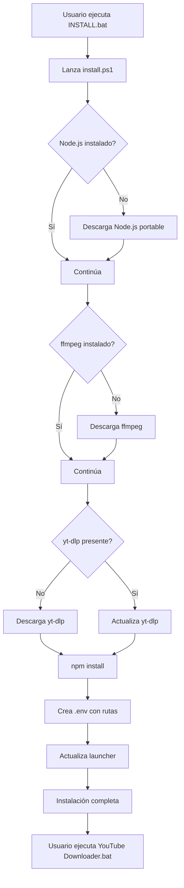

# 📦 Sistema de Instalación Automática - YouTube Downloader

## Archivos Creados

### 1. `INSTALL.bat` - Launcher del Instalador
- **Propósito**: Punto de entrada simple para usuarios
- **Función**: Ejecuta el script PowerShell con los permisos necesarios
- **Uso**: Doble clic para iniciar la instalación

### 2. `install.ps1` - Script Principal de Instalación
- **Propósito**: Automatizar toda la configuración del proyecto
- **Funciones**:
  - ✅ Detecta si Node.js está instalado, si no, descarga versión portable
  - ✅ Descarga e instala ffmpeg automáticamente
  - ✅ Descarga e instala yt-dlp (última versión)
  - ✅ Ejecuta `npm install` para dependencias del proyecto
  - ✅ Crea archivo `.env` con rutas detectadas automáticamente
  - ✅ Actualiza el script de inicio `YouTube Downloader.bat`

### 3. `INSTALL_GUIDE.md` - Guía de Instalación
- **Propósito**: Documentación completa del proceso de instalación
- **Contenido**:
  - Instrucciones paso a paso para instalación automática
  - Alternativa de instalación manual
  - Solución de problemas comunes
  - Estructura del proyecto

### 4. Actualizaciones a Archivos Existentes

#### `.env.example`
- Actualizado con variables que el instalador configura automáticamente
- Incluye comentarios sobre las rutas predeterminadas

#### `README.md`
- Sección de instalación reorganizada
- Instalación automática destacada como método recomendado
- Instalación manual como opción avanzada

#### `.gitignore`
- Agregada carpeta `tools/` (donde se descargan Node.js y ffmpeg)
- Excluye binarios descargados automáticamente

#### `YouTube Downloader.bat`
- Actualizado para incluir `tools/node` y `tools/ffmpeg/bin` en el PATH
- Garantiza que funcione con las herramientas descargadas por el instalador

## Flujo de Instalación



## Estructura de Directorios Después de la Instalación

```
youtube_downloader/
├── INSTALL.bat              # ← Ejecutar primero
├── install.ps1              # Script de instalación
├── INSTALL_GUIDE.md         # Guía completa
├── YouTube Downloader.bat   # ← Ejecutar para usar la app
├── tools/                   # ← Creado por el instalador
│   ├── node/               # Node.js portable
│   │   ├── node.exe
│   │   ├── npm
│   │   └── ...
│   └── ffmpeg/             # ffmpeg
│       ├── bin/
│       │   ├── ffmpeg.exe
│       │   └── ffprobe.exe
│       └── ...
├── yt-dlp.exe              # ← Descargado por el instalador
├── .env                    # ← Creado por el instalador
├── node_modules/           # ← Instalado por npm
└── ...
```

## Ventajas del Sistema de Instalación

### Para el Usuario
1. **Cero configuración manual** - Todo se hace automáticamente
2. **Sin permisos de administrador** - Usa versiones portables
3. **Sin contaminar el sistema** - Todo se instala en la carpeta del proyecto
4. **Actualización fácil** - Ejecutar `INSTALL.bat` nuevamente actualiza todo
5. **Desinstalación simple** - Eliminar la carpeta del proyecto

### Para el Desarrollador
1. **Menos soporte técnico** - Los usuarios no necesitan instalar dependencias manualmente
2. **Configuración consistente** - Todos usan las mismas versiones
3. **Fácil distribución** - Solo compartir el repositorio
4. **Portable** - Funciona en cualquier PC con Windows sin instalación previa

## Requisitos del Sistema

- **Sistema Operativo**: Windows 7 o superior
- **Conexión a Internet**: Requerida durante la instalación (para descargas)
- **Espacio en Disco**: ~500 MB para todas las herramientas
- **PowerShell**: Incluido en Windows por defecto

## Solución de Problemas del Instalador

### Error: "No se puede ejecutar scripts"
**Causa**: Política de ejecución de PowerShell restrictiva  
**Solución**:
```powershell
Set-ExecutionPolicy -ExecutionPolicy RemoteSigned -Scope CurrentUser
```

### Error: "No se puede descargar archivos"
**Causa**: Firewall o antivirus bloqueando descargas  
**Solución**:
- Desactivar temporalmente el antivirus
- Agregar excepción para PowerShell en el firewall
- Descargar manualmente desde los enlaces en `INSTALL_GUIDE.md`

### Instalación se queda congelada
**Causa**: Descarga lenta o timeout  
**Solución**:
- Verificar conexión a internet
- Ejecutar nuevamente `INSTALL.bat`
- El script detectará lo ya descargado y continuará

## URLs de Descarga Utilizadas

El instalador descarga desde estas fuentes oficiales:

1. **Node.js**: `https://nodejs.org/dist/v20.11.0/node-v20.11.0-win-x64.zip`
2. **ffmpeg**: `https://github.com/BtbN/FFmpeg-Builds/releases/download/latest/ffmpeg-master-latest-win64-gpl.zip`
3. **yt-dlp**: `https://github.com/yt-dlp/yt-dlp/releases/latest/download/yt-dlp.exe`

## Mantenimiento

### Actualizar Herramientas
Ejecutar `INSTALL.bat` nuevamente actualizará:
- yt-dlp a la última versión
- Dependencias npm del proyecto

### Limpiar Instalación
Para reinstalar desde cero:
```powershell
# Eliminar herramientas descargadas
Remove-Item -Recurse -Force tools/
Remove-Item yt-dlp.exe
Remove-Item .env

# Ejecutar instalador nuevamente
.\INSTALL.bat
```

## Próximas Mejoras Posibles

- [ ] Soporte para macOS y Linux
- [ ] Interfaz gráfica para el instalador
- [ ] Selección de versiones de herramientas
- [ ] Instalador offline (con herramientas incluidas)
- [ ] Auto-actualización de la aplicación
- [ ] Desinstalador automático

---

**Creado para facilitar la instalación y uso del YouTube Downloader** 🚀
